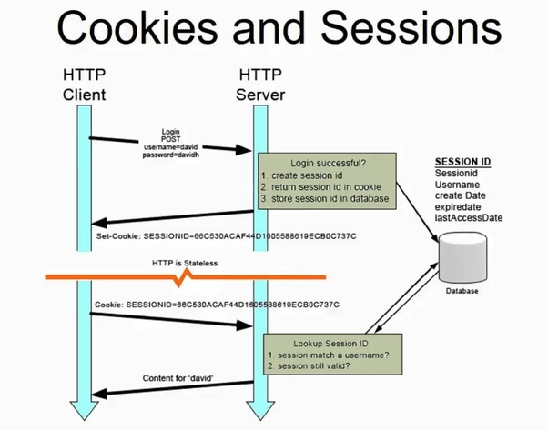

# Security Summer School Cheatsheet

Useful so far for midterm

## Session 01: Web Basics ([course](https://security-summer-school.github.io/web/web-basics-browser-security-model/))

Stateful (sessions) vs Stateless (no memory)

Static (fast & simple) vs Dynamic (complex & customizable)

CVE - database of known vulnerabilities of a site (CVE-year-code) => cpe (vulnerable platforms)
CWE - database of known vulnerabilities group by effect

HTTP - protocol on port 80
HTTPS - protocol on port 443

## Session 02 - Cookies, Sessions & Access Control ([course](https://security-summer-school.github.io/web/cookies-session-management-access-control/))

cookies = stored info on client part (HttpOnly (criptare) + Secure (in http si https))
session: 
